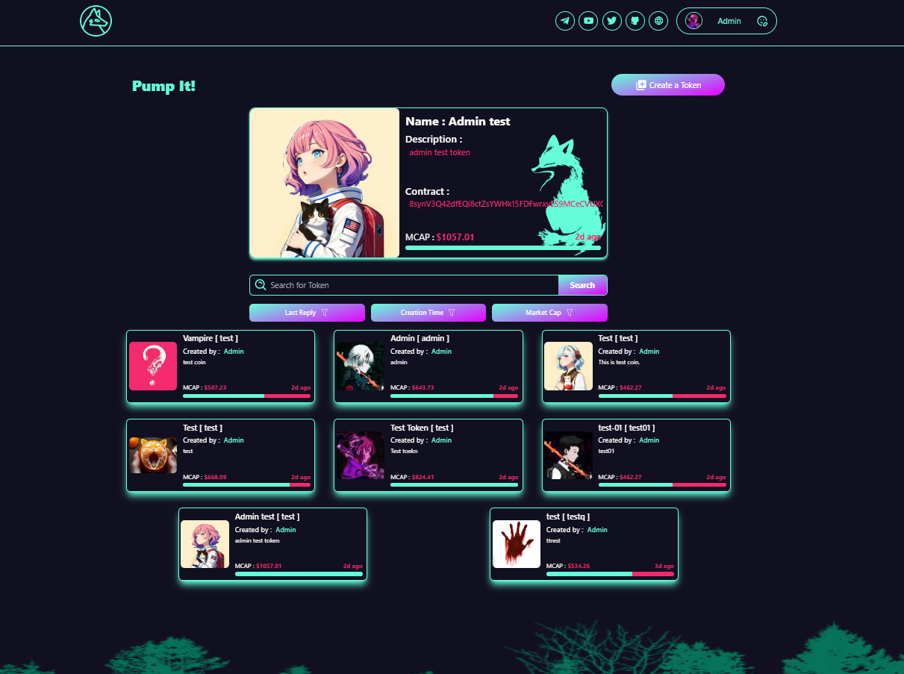
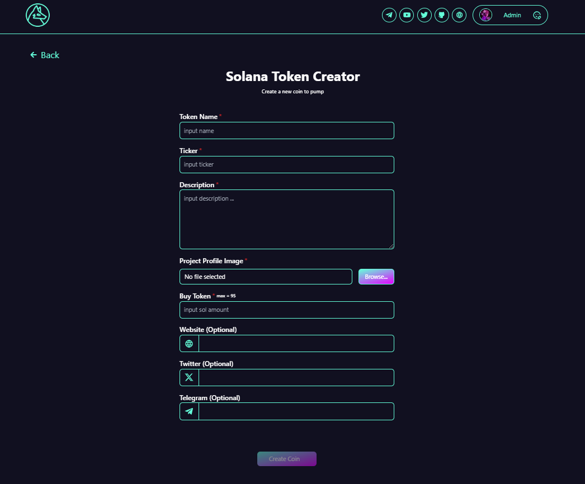
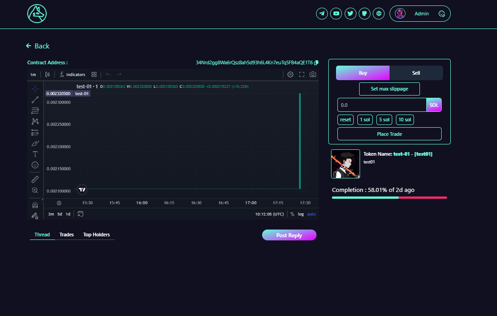
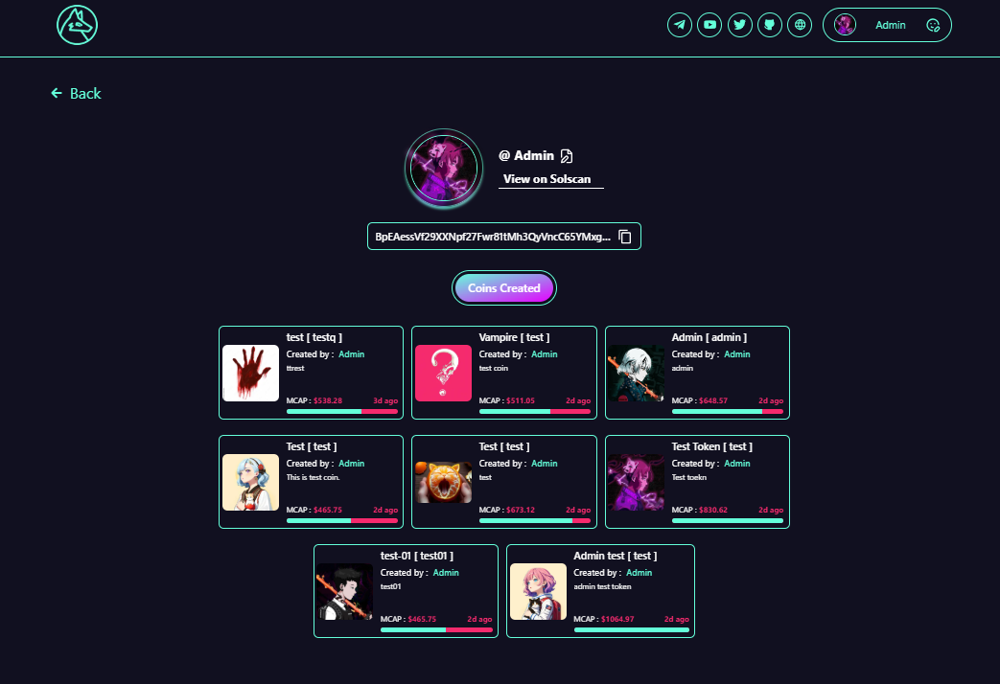

# LaunchBase



[Demo Video](./assets/413380243-d65b9270-6b99-44aa-aa0f-bc376c992589.mp4)

A full-stack decentralized token launch platform built on Solana, featuring a modern frontend, RESTful backend, and secure smart contract integration for token creation and trading.

---

## Tech Stack

**Frontend**
- Next.js with TypeScript
- Tailwind CSS

**Backend**
- Node.js with Express
- MongoDB

**Smart Contract**
- Rust-based Solana smart contracts

---

## Features

- Token launch and trading interface
- Real-time token information and analytics
- User-customizable content management
- Secure smart contract integration
- RESTful API for data operations
- Responsive, modern UI

---

## Prerequisites

- Node.js (v14 or higher)
- Yarn package manager
- MongoDB (local or Atlas)

---

## Installation

1. Clone the repository:
   ```bash
   git clone https://github.com/0xalberto/pumpfun-smart-contract-frontend-backend.git
   cd pumpfun-smart-contract-frontend-backend
   ```

2. Install dependencies:
   ```bash
   yarn install
   ```

3. Configure environment variables:
   Create a `.env` file in the root directory:
   ```env
   MONGO_URI=<your-mongodb-connection-string>
   NODE_ENV=development
   ```

4. Ensure MongoDB is running locally or via MongoDB Atlas.

---

## Usage

**Start the development server:**
```bash
yarn dev
```
Access the application at http://localhost:3000

**Start the backend server:**
```bash
yarn start
```

---

## Project Structure

```
pumpfun-smart-contract-frontend-backend/
├── frontend/
│   ├── components/        # Reusable UI components
│   ├── pages/             # Next.js pages
│   └── styles/            # Tailwind CSS styles
├── backend/
│   ├── controllers/       # API controllers
│   ├── models/            # Mongoose models
│   ├── routes/            # API routes
│   └── server.js          # Express server
├── smart-contract/        # Rust smart contracts
└── assets/                # Project assets
```

---

## Important Notes

- Configure MongoDB connection string in `.env` before running
- Use production credentials and secure environment variables for deployment
- Smart contracts require appropriate Solana network configuration

---

## Contact

For questions or collaboration:
- **Telegram**: [@soladity](https://t.me/soladity)

---

## Screenshots




